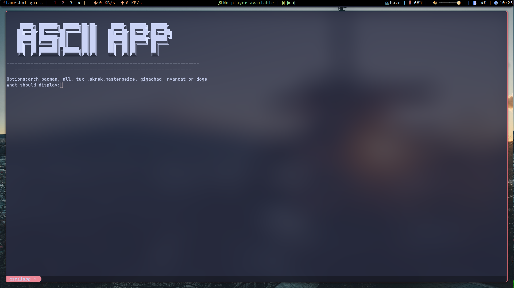

This is asciiapp, my first python app.

___________________________________________

To install it, just clone this repo and run it as a python script (With python3 installed)
```shell
git clone https://www,github.com/Jadonus/asciiapp

cd asciiapp

python3 asciiapp.py
```
_________________________________________
That should get you up and running. 

